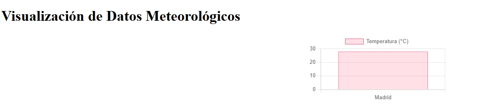

# ClimaAPI-Flask

## Descripción
ClimaAPI-Flask es una API REST construida con Flask que devuelve datos meteorológicos simulados por ciudad. La API incluye endpoints para obtener y agregar datos meteorológicos, así como documentación interactiva con Swagger. Además, se proporciona una visualización de datos utilizando Chart.js.

## Características
- Endpoints GET/POST para obtener y agregar datos meteorológicos.
- Validación de parámetros.
- Documentación interactiva con Swagger.
- Pruebas automatizadas con pytest.
- Visualización de datos con Chart.js.
- Actividad gamificada: "Detective del clima".

## Requisitos
- Python 3.x
- pip (gestor de paquetes de Python)

## Instalación

1. **Clona el repositorio** (si está en un repositorio remoto) o descarga el código fuente.

   ```bash
   git clone <URL_DEL_REPOSITORIO>
   cd ClimaAPI-Flask

2. Crea un entorno virtual y actívalo:

   ```bash
   python -m venv venv
   # En Windows
   venv\Scripts\activate
   # En macOS/Linux
   source venv/bin/activate

3. Instala las dependencias:
   ```bash
   pip install Flask Flask-RESTful Flask-Swagger-UI flask-cors pytest
4. Ejecutar:
   ```app.py
   La API estará disponible en:
   
   http://127.0.0.1:5000/weather/Madrid

5. Visualización de datos con navegador


