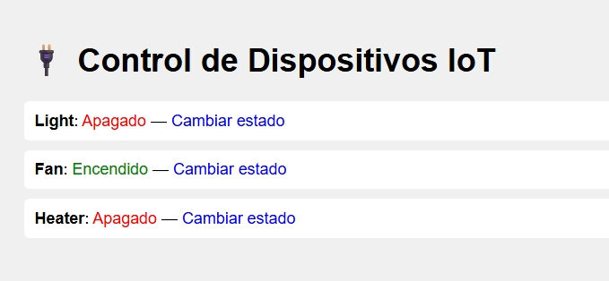

# ControlBot-Bottle

## Descripción
Aplicación embebida con Bottle que simula el control de dispositivos IoT desde una interfaz web. Ideal para introducir conceptos de redes, automatización y programación web.

## Características
- Todo en un solo archivo `.py`
- Enrutamiento básico con Bottle
- Plantilla HTML simple y visual
- Simulación de estado de dispositivos

## Esquema de red embebida
```bash
   [UUsuario Web] ⇄ [Servidor Bottle] ⇄ [Dispositivos simulados]
```

## Actividad sugerida: “Controla tu casa inteligente”
1. Agrega más dispositivos (ej. cafetera, aire acondicionado).
2. Integra micro:bit o simuladores para activar LEDs o motores.
3. Diseña una interfaz visual con íconos o animaciones.
4. Simula sensores (temperatura, movimiento) y reacciones automáticas.

## Ejecución
```bash
py control_bot.py


