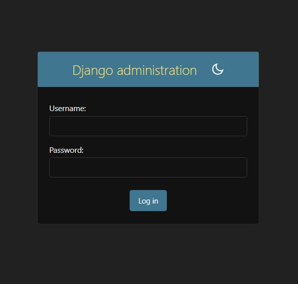
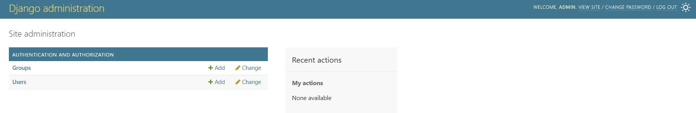

# EduPanel-Django

## Descripción
EduPanel-Django es un sistema de gestión de cursos con usuarios, inscripciones y un panel de administración para docentes.

## Características
- CRUD de cursos y estudiantes
- Autenticación y roles (admin/docente/estudiante)
- Panel admin personalizado
- Base de datos con ORM

## Instalación
1. Clona el repositorio.
2. Instala las dependencias:
   ```bash
   pip install django7
3. Crear usuario y contraseña:
   ```bash
   python manage.py createsuperuser

  - La contraseña debe contener al menos 8 caracteres. 
    Si te sale:" Bypass password validation and create user anyway? [y/N]:" - Elejir N y  pobra con nueva contraseña para mejor uso.

4. Inicia el servidor:
   ```bash
   python manage.py runserver
   ```
   Ahora puedes acceder a tu aplicación en http://127.0.0.1:8000/, y al panel de administración en: 
   ```
   http://127.0.0.1:8000/admin/

## 🧪 ¿Cómo funciona?

1. Ingresá el **usuario y contraseña** que creaste previamente:
   

2. Una vez autenticado, accederás al **panel de administración de Django**:
   
   
   > 🛠️ Este es el panel donde podés gestionar cursos, estudiantes y docentes.
