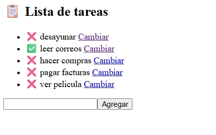
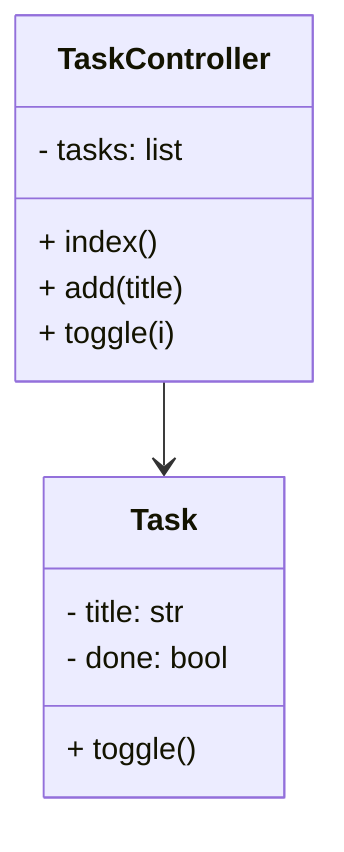

# 📋 TareasModular-CherryPy

## 🧠 ¿Qué es?

Un backend modular en Python con CherryPy que permite **crear, editar y marcar tareas como completadas** desde una interfaz web. Ideal para enseñar arquitectura orientada a objetos, manejo de sesiones y rendimiento web.

---

## 🎯 ¿Qué vas a lograr?

Al ejecutar el proyecto, verás una interfaz como esta:

- ✅ Tareas completadas con íconos verdes  
- ❌ Tareas pendientes con íconos rojos  
- 📝 Campo para agregar nuevas tareas  
- 🔄 Enlace “Cambiar” para modificar el estado de cada tarea  

> La interfaz muestra una lista interactiva de tareas con estado visual y edición en tiempo real. Perfecta para actividades didácticas o demostraciones técnicas.

---
## Ejecución
```bash
py app.py
```
- O accede directamente desde tu ordenador: http://localhost:8080/tasks

  

## 🧩 Características técnicas

- Arquitectura modular (modelo + controlador)
- Servidor HTTP multihilo con CherryPy
- Manejo de sesiones en memoria
- Integración con frontend externo (HTML estático o SPA)
- Código limpio, extensible y didáctico

---

## 🧪 Diagrama de clases



---
## ⚔️ Comparación CherryPy vs Flask
| Característica         | CherryPy                          | Flask                          |
|------------------------|-----------------------------------|--------------------------------|
| Modularidad            | Nativa (clases + rutas)           | Manual (Blueprints)            |
| Multihilo              | ✅ Sí                             | ⚠️ Depende del servidor         |
| Sesiones               | RAM / archivo / DB                | Cookies / extensiones          |
| Rendimiento (local)    | 🔥 Rápido en RAM                  | ⚡ Ligero pero variable         |
| Curva de aprendizaje   | 📈 Media                          | 📉 Baja                         |

---
## 🧠 Actividad sugerida: “Organiza tu semana”
- Agregá tareas con prioridad y fecha límite
- Simulá usuarios con sesiones separadas
- Personalizá el frontend con íconos, colores o animaciones
- Compará rendimiento con Flask usando timeit o ab

